# Relatório Final — Previsão de Ritmo por Percurso e Zona Cardíaca

## 1. Objetivo

O projeto estima o ritmo pessoal de corrida num percurso conhecido a partir da posição no percurso, do perfil altimétrico e da zona cardíaca escolhida. A frequência cardíaca exata classifica os dados históricos em Z1–Z5, mas não entra como feature. Foram comparados cinco algoritmos de regressão e um baseline constante; um único vencedor foi treinado no final.

## 2. Dados

- FIT crus auditados: **34**.
- Atividades válidas na análise inicial: **34**.
- Distância histórica total: **313.5 km**.
- Período: **2026-01-16T17:33:26+00:00** a **2026-09-03T16:31:29+00:00**.
- Os FIT originais permanecem em `Dados/brutos/`; todos os datasets derivados ficam em `Dados/processados/`.
- O manifesto guarda o hash SHA-256 de cada origem e os parâmetros de processamento.

## 3. Análise exploratória inicial

O resumo abaixo resulta diretamente dos registos normalizados.

|   atividade_id |   ritmo_medio_s_km |   fc_media_bpm |   subida_aproximada_m |   distancia_km |
|---------------:|-------------------:|---------------:|----------------------:|---------------:|
|    21568213058 |             402.9  |         156.05 |                 111.4 |           4.7  |
|    21574110161 |             398.18 |         163.11 |                 157.2 |           8.13 |
|    21604546980 |             575.54 |         128.89 |                 124.2 |           2.49 |
|    21648150892 |             444.74 |         173.63 |                 430.2 |          15.08 |
|    21682806144 |             570.63 |         134.19 |                 336.8 |           4.7  |
|    21703191468 |             662    |         149.84 |                 246.2 |           4.05 |
|    21729420815 |             498.82 |         169    |                 620.2 |          15.08 |
|    21827489413 |             588.82 |         138.51 |                 350   |           7.11 |
|    21848059283 |             502.43 |         148.84 |                 277.4 |           8.02 |
|    21862167927 |             401.18 |         171.18 |                 413.8 |          18.13 |
|    21909979898 |             517.1  |         136.7  |                 244   |           6    |
|    21946978854 |             511.55 |         153.06 |                 438.4 |          12.83 |
|    22118031985 |             503.74 |         146.12 |                 333   |           8.16 |
|    22259327797 |             440.12 |         174.81 |                 587.2 |          12.99 |
|    22582028728 |             457.81 |         170.82 |                 312   |          10.57 |
|    22610623020 |             572.79 |         136.54 |                 256.6 |           5.35 |
|    22664327478 |             583.22 |         179.11 |                 816   |          15.51 |
|    22882313372 |             500.14 |         136.41 |                 120   |           5.67 |
|    22910890927 |             446.26 |         166.17 |                 436.8 |          13.28 |
|    22943992812 |             402.81 |         162.04 |                  88.2 |           6.71 |
|    22980101796 |             450.56 |         155.77 |                 213.4 |          18.01 |
|    23059351180 |             313.21 |         177.03 |                  84.8 |           5.01 |
|    23064485029 |             512.37 |         141    |                 335.8 |          14.01 |
|    23095730671 |             351.42 |         160.67 |                 122.4 |           6.56 |
|    23119535339 |             489.99 |         134.76 |                 188   |           9.01 |
|    23161986328 |             533    |         177.75 |                1138   |          18.86 |
|    23192176528 |             521.89 |         130.6  |                 113.6 |           5.53 |
|    23219229363 |             395.43 |         154.44 |                  98.2 |           7.27 |
|    23299035298 |             392.88 |         158.46 |                 183.2 |           9.43 |
|    23356119297 |             374.17 |         161.98 |                  85.4 |           6.44 |
|    23379302381 |             294.69 |         178.72 |                  43   |           5.01 |
|    23996168837 |             476.36 |         165.41 |                 168.8 |           7.01 |
|    24069625931 |             405.87 |         168.01 |                 290.8 |          11.63 |
|    24225591249 |             386.01 |         165.69 |                 102.4 |           5.2  |

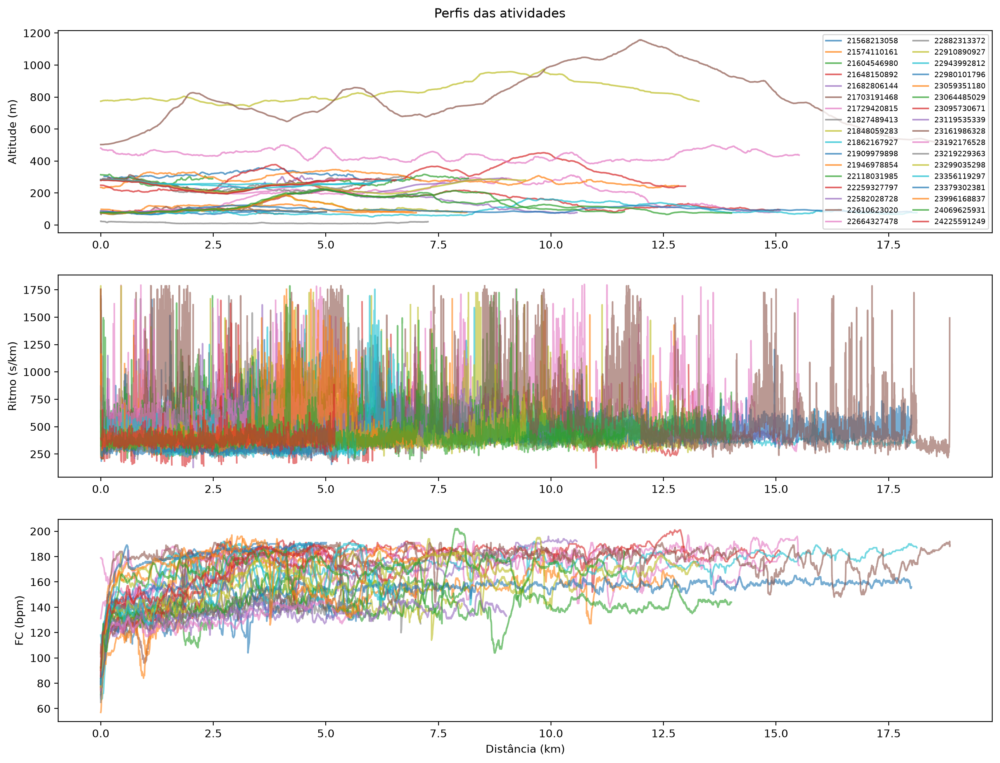

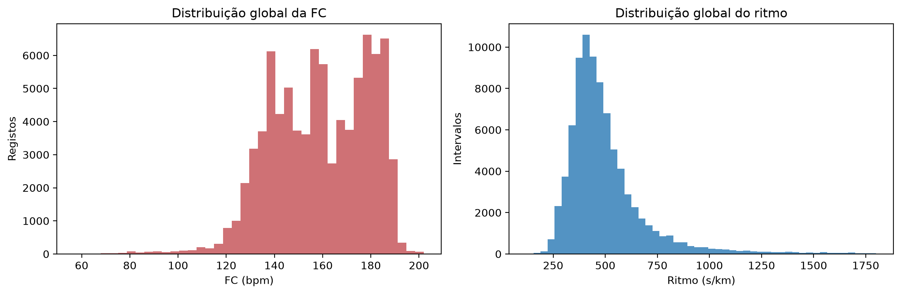

## 4. Qualidade dos dados

Foram auditados **85237** intervalos. Nenhuma exclusão foi silenciosa; cada linha conserva `valido` e `motivo_exclusao`.

O filtro causal usa os últimos **40 s**, exige pelo menos **4 medições** que cubram **30 s**, amplitude robusta P90−P10 até **15 bpm** e diferença para a média temporal até **8 bpm**. São aceites intervalos até **15 s**, o que inclui gravação inteligente do Garmin; cada troço precisa de pelo menos **2 intervalos** e cobertura entre **60%** e **120%**.

| motivo                             |     n |   percentagem |
|:-----------------------------------|------:|--------------:|
| valido                             | 76686 |         89.97 |
| primeiros_120s                     |  2404 |          2.82 |
| amplitude_robusta_fc_excessiva     |  2083 |          2.44 |
| diferenca_media_temporal_excessiva |  1322 |          1.55 |
| pausa                              |  1114 |          1.31 |
| velocidade_inferior_limiar         |   991 |          1.16 |
| cobertura_fc_insuficiente          |   557 |          0.65 |
| salto_temporal                     |    43 |          0.05 |
| timestamp_invalido                 |    34 |          0.04 |
| salto_distancia                    |     3 |          0    |

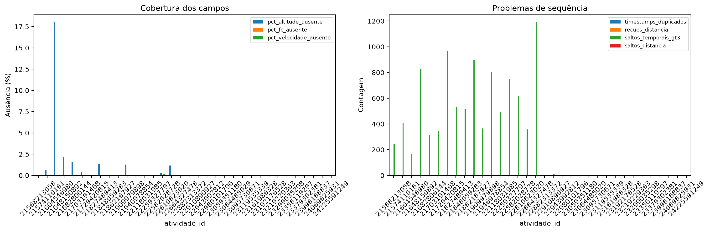

## 5. Perfil do percurso e variável-alvo

O perfil usa apenas distância e altitude, variáveis disponíveis antes da corrida. A altitude foi interpolada a cada **10 m**, suavizada por média centrada de cinco pontos e dividida em troços de **50 m**. A suavização centrada é válida neste contexto porque o perfil completo é conhecido antes da partida.

A altitude usada pelo modelo foi colocada numa escala fixa através de `altitude_media_m / 1000` após a interpolação e suavização. Esta transformação preserva a diferença de altitude absoluta entre percursos, não depende dos dados de outras atividades e evita fuga na validação. A altitude em metros foi preservada nos dados do perfil e nos gráficos.

O alvo foi calculado por:

`ritmo_alvo_s_km = 1000 × soma(tempo válido) / soma(distância válida)`

O campo de velocidade do FIT não foi usado para construir o alvo.

## 6. Zonas cardíacas

| nome   |   limite_inferior_bpm |   limite_superior_bpm |
|:-------|----------------------:|----------------------:|
| Z1     |                   103 |                   124 |
| Z2     |                   124 |                   144 |
| Z3     |                   144 |                   165 |
| Z4     |                   165 |                   185 |
| Z5     |                   185 |                   206 |

Origem: Limites pessoais Garmin do campo hr_zone_high_boundary no time_in_zone da atividade 24225591249_ACTIVITY.fit; a mesma configuração consta nas três atividades mais recentes.

Nota: A configuração atual do Garmin é aplicada de forma consistente a todas as atividades históricas. Os FIT mais antigos contêm limites diferentes; esta alteração histórica deve ser mencionada como limitação.

## 7. Dataset final

- Amostras: **5376**.
- Atividades com amostras elegíveis: **34**.
- Features: **9**, todas conhecidas antes da corrida.
- O dataset não contém FC exata, potência nem velocidade como entrada do modelo.

|   zona_ordem |   amostras |   atividades |   ritmo_mediano_s_km |
|-------------:|-----------:|-------------:|---------------------:|
|            1 |         80 |           12 |               496.88 |
|            2 |       1190 |           29 |               493    |
|            3 |       1392 |           31 |               459.63 |
|            4 |       2084 |           25 |               411.23 |
|            5 |        630 |           18 |               401.64 |

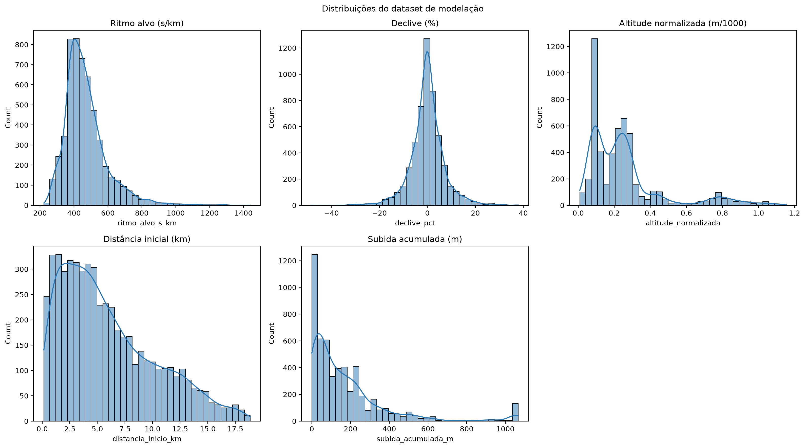

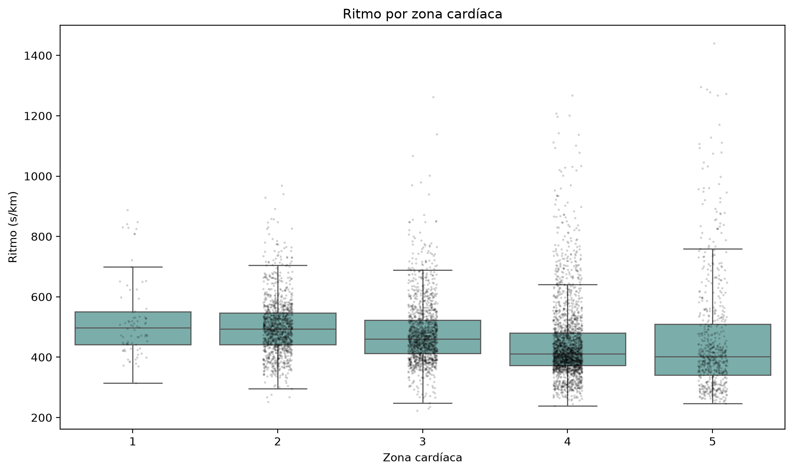

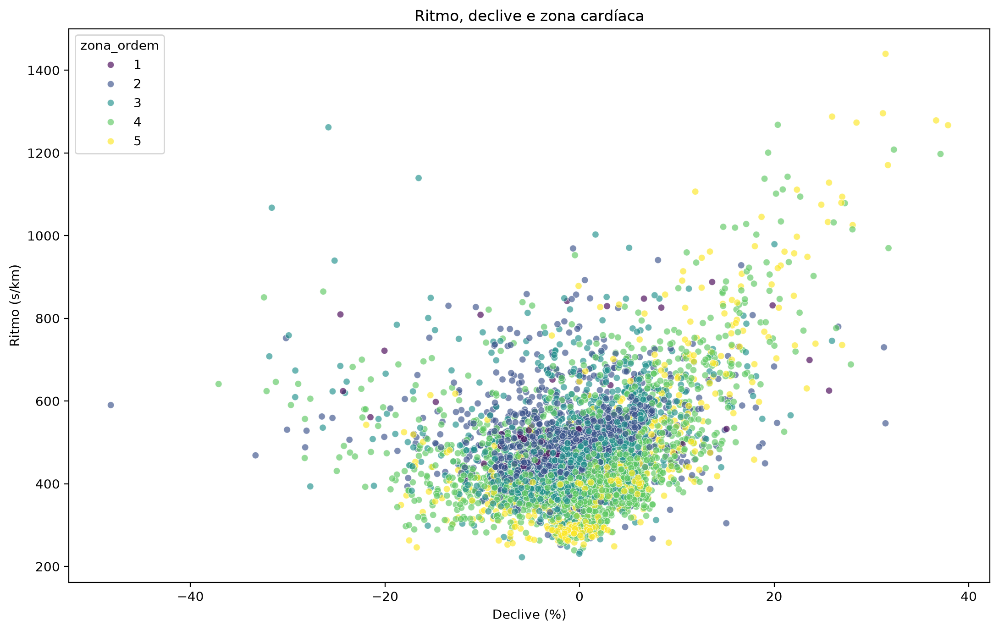

## 8. Validação por atividades

Foi aplicado `LeaveOneGroupOut` com **34 folds**. Em cada fold, uma atividade completa ficou no teste e as restantes no treino. Os pesos deram o mesmo peso total a cada atividade de treino. Scalers e modelos foram ajustados apenas dentro do treino de cada fold.

As métricas apresentadas resultam apenas de previsões fora do treino. O modelo final treinado com todos os dados não foi usado para estimar desempenho.

## 9. Modelos comparados

- Ridge com padronização;
- Random Forest;
- Gradient Boosting com perda Huber;
- HistGradientBoosting com restrições monotónicas;
- SVR RBF com padronização;
- rede neuronal MLP (32 e 16 neurónios), com padronização, regularização L2 e paragem antecipada;
- DummyRegressor como baseline constante.

Todos receberam as mesmas linhas, folds e pesos. Os parâmetros foram fixados antes da avaliação; não houve tuning na atividade de teste.

A MLP foi mantida pequena devido ao número reduzido de atividades. Em vários folds, o otimizador atingiu o limite de 1 000 iterações enquanto ainda melhorava, pelo que o resultado representa uma primeira experiência e não uma otimização exaustiva da arquitetura.

## 10. Resultados

| modelo               |   mae_macro_s_km |   rmse_macro_s_km |   r2_macro |   melhoria_vs_dummy_pct |   tempo_treino_medio_s | vencedor   |
|:---------------------|-----------------:|------------------:|-----------:|------------------------:|-----------------------:|:-----------|
| GradientBoosting     |            68.58 |             87.65 |      -1.15 |                   30.62 |                   0.85 | True       |
| RandomForest         |            69.25 |             87.88 |      -1.12 |                   29.95 |                   0.4  | False      |
| HistGradientBoosting |            69.79 |             89.26 |      -1.22 |                   29.4  |                   0.96 | False      |
| RedeNeuronal_MLP     |            75.44 |             95.51 |      -1.94 |                   23.69 |                   9.96 | False      |
| Ridge                |            85.6  |            106.04 |      -6.04 |                   13.41 |                   0    | False      |
| SVR_RBF              |            89.19 |            113.3  |      -7.37 |                    9.77 |                   0.53 | False      |
| Dummy                |            98.85 |            120.04 |     -14.56 |                    0    |                   0    | False      |

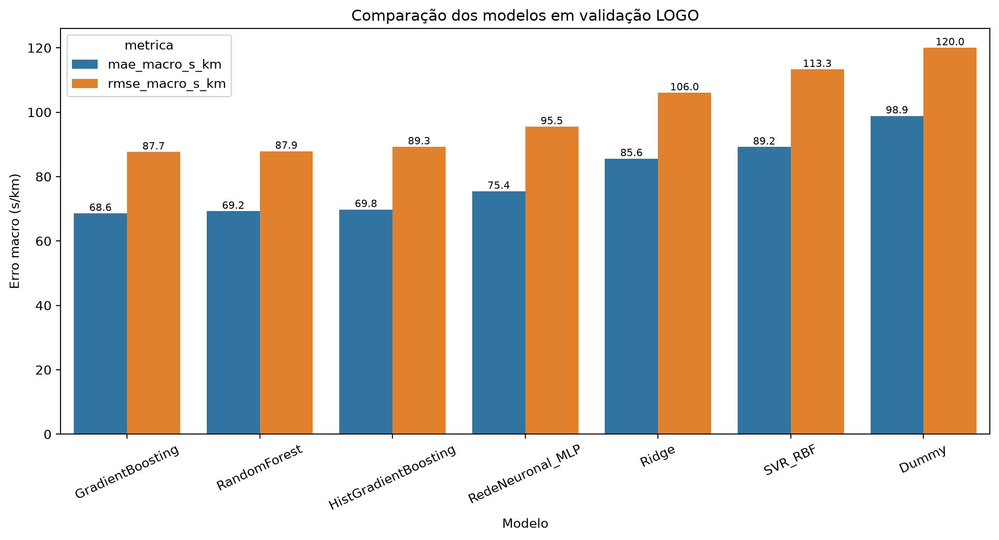

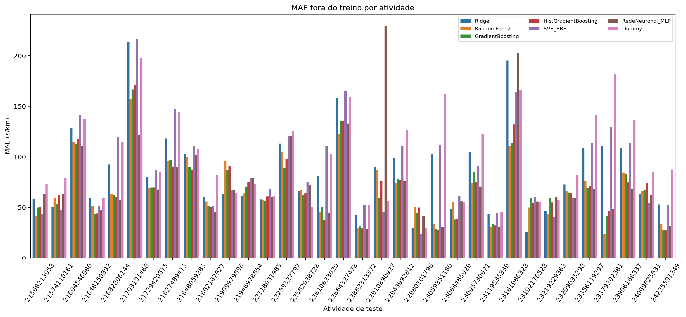

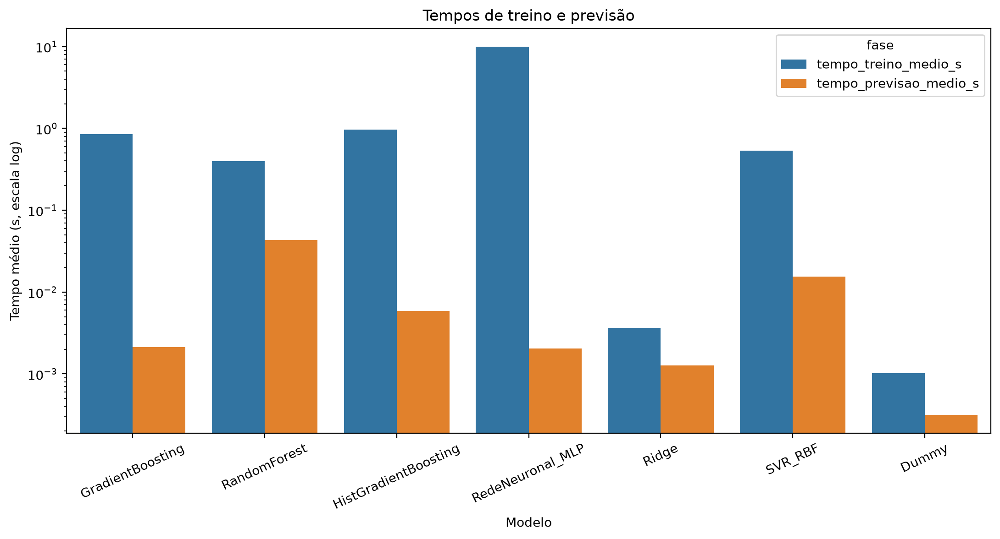

## 11. Diagnóstico do vencedor

O modelo vencedor foi **GradientBoosting**, com MAE macro de **68.58 s/km**, RMSE macro de **87.65 s/km**, R² macro de **-1.151** e melhoria de **30.6%** face ao baseline.

O R² macro negativo mostra que a generalização entre algumas atividades é fraca apesar da redução do erro absoluto face ao baseline. As atividades representam percursos e tipos de treino diferentes; por isso, MAE por atividade e cobertura do espaço de features são essenciais para interpretar o resultado.

Desempenho por frequência de gravação:

| modo_gravacao   |   atividades |   amostras |   mae_medio_s_km |   rmse_medio_s_km |
|:----------------|-------------:|-----------:|-----------------:|------------------:|
| 1 segundo       |           17 |       2726 |            57.93 |             72.42 |
| inteligente     |           17 |       2650 |            79.24 |            102.89 |

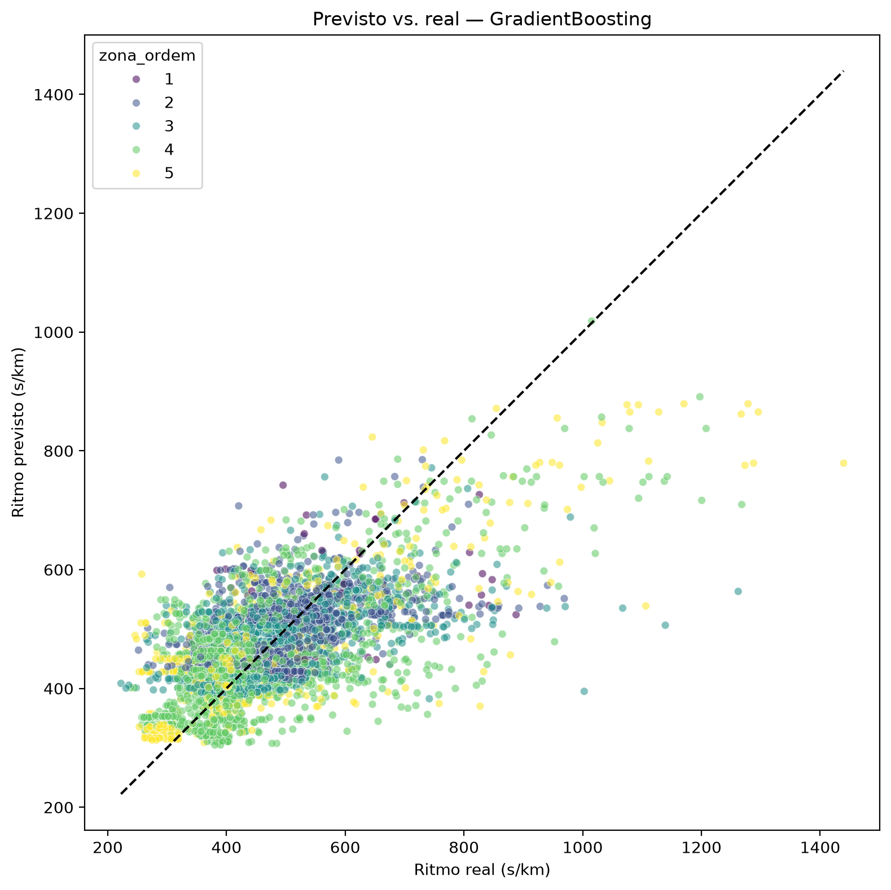

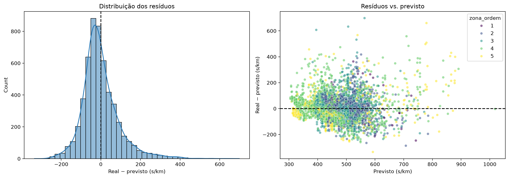

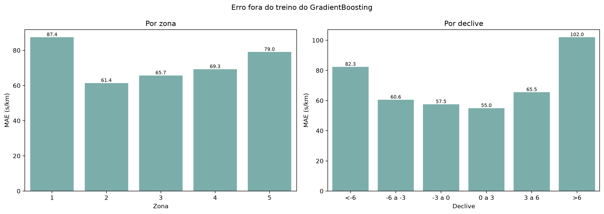

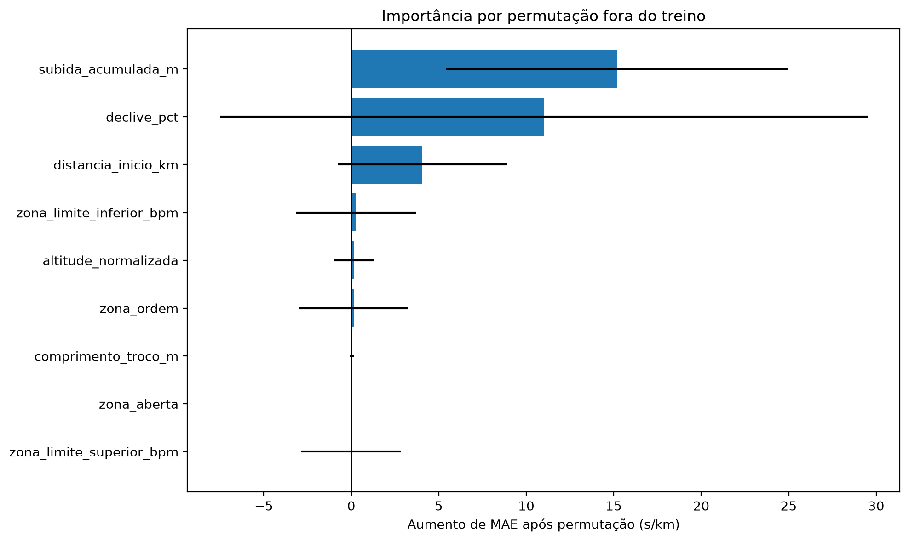

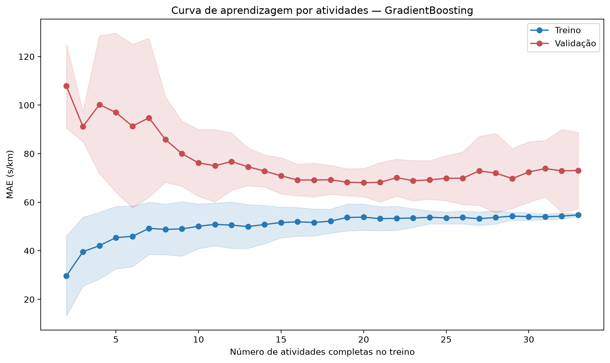

## 12. Experiência com zonas de potência

Foi testada a substituição das zonas cardíacas por gamas de potência. Para tornar a comparação justa, foram usados os mesmos **2972 troços**, as mesmas **17 atividades**, os mesmos alvos e os mesmos folds `LeaveOneGroupOut`. A experiência só incluiu atividades com potência; por isso, estas métricas não são diretamente comparáveis com as do modelo principal.

A potência e a FC exatas serviram apenas para classificar os dados históricos e calcular correlações de diagnóstico. Nenhum valor exato de potência foi usado como feature dos modelos comparados.

| tipo_zona           |   pearson_valor_ritmo |   spearman_valor_ritmo |   spearman_zona_ritmo |   n_trocos |   n_atividades |
|:--------------------|----------------------:|-----------------------:|----------------------:|-----------:|---------------:|
| Frequência cardíaca |                -0.216 |                 -0.42  |                -0.431 |       2972 |             17 |
| Potência            |                -0.528 |                 -0.569 |                -0.108 |       2972 |             17 |

A potência média contínua apresentou uma associação mais forte com o ritmo, com Spearman de **−0,569**, contra **−0,420** para a FC média. Ao reduzir os valores às cinco gamas Garmin, a associação da zona de potência caiu para **−0,108**, enquanto a zona cardíaca manteve **−0,431**. A divisão em cinco gamas perde, portanto, grande parte da informação disponível na potência contínua.

O melhor resultado com zonas cardíacas foi **GradientBoosting**, com MAE macro de **55.93 s/km** e RMSE de **73.17 s/km**. Com zonas de potência, **RandomForest** obteve MAE de **53.26 s/km** e RMSE de **73.06 s/km**.

A redução média do MAE foi de apenas **2.67 s/km**. A potência venceu em **8 de 17 atividades**, e o intervalo bootstrap de 95% da diferença potência menos FC foi **[-8.94, 3.49] s/km**, incluindo zero. A melhoria não é suficientemente consistente para justificar a troca.

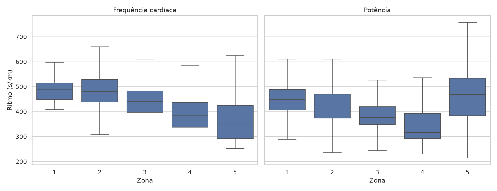

**Decisão:** o modelo final e a aplicação mantêm exclusivamente as zonas cardíacas. O resultado da potência fica registado como experiência e poderá ser revisto quando existirem mais atividades com potência.

## 13. Previsão de percurso

Percurso de demonstração: `Dados/brutos/24225591249_ACTIVITY.fit`.

| zona   |   distancia_valida_m |   tempo_estimado_sem_paragens_s | ritmo_medio_mmss_km   |   distancia_pouco_suporte_m |   trocos_invalidos |
|:-------|---------------------:|--------------------------------:|:----------------------|----------------------------:|-------------------:|
| Z1     |              5199.35 |                         2646.23 | 08:29/km              |                     1749.35 |                  0 |
| Z2     |              5199.35 |                         2484.52 | 07:58/km              |                        0    |                  0 |
| Z3     |              5199.35 |                         2274.05 | 07:17/km              |                        0    |                  0 |
| Z4     |              5199.35 |                         1872.8  | 06:00/km              |                        0    |                  0 |
| Z5     |              5199.35 |                         1768.98 | 05:40/km              |                      850    |                  0 |

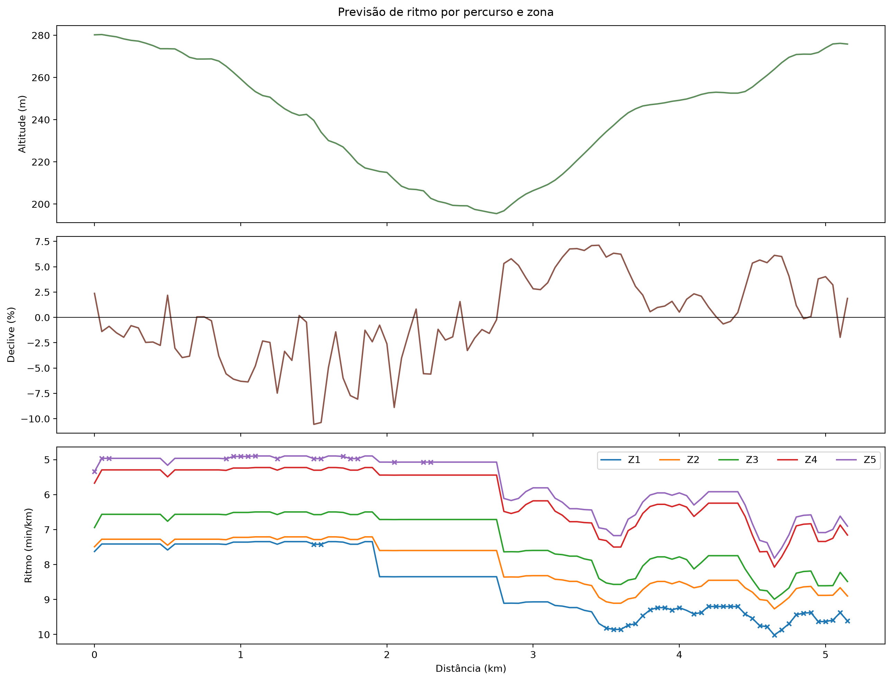

A previsão assume permanência na zona escolhida e não simula a resposta cardíaca real durante o esforço.

## 14. Limitações

- O estudo contém **34 atividades elegíveis** de uma única pessoa; a validade externa para outras pessoas é reduzida.
- Foram identificados **657 candidatos a outlier** por IQR e nenhum foi removido automaticamente.
- A cobertura das zonas é desigual. A zona com menos dados tem **80 amostras**, o que torna as suas previsões especialmente incertas.
- As zonas atuais do Garmin foram aplicadas a todo o histórico. Alguns FIT antigos registam limites diferentes, pelo que a evolução da configuração pessoal pode introduzir inconsistência.
- A validação por atividade evita a fuga entre troços correlacionados, mas novos percursos podem ter altitudes, declives ou distâncias fora da cobertura histórica.
- O filtro de FC é causal, mas seleciona apenas períodos estáveis e pode favorecer troços com comportamento fisiológico mais regular.
- A previsão por zona assume que o atleta permanece nessa zona; o modelo não simula atraso ou deriva da resposta cardíaca.
- Se fosse usada a fórmula `220 - idade`, ela seria apenas uma aproximação. Nesta execução, os limites vieram diretamente da configuração Garmin mais recente.

## 15. Conclusões

O **GradientBoosting** apresentou o menor MAE macro fora do treino, com **68.58 s/km**, e superou o baseline em **30.6%**. O desempenho varia bastante entre atividades e o R² macro permaneceu negativo, pelo que as previsões devem ser lidas em conjunto com os indicadores de pouco suporte e com os gráficos por zona, declive e atividade.

A experiência com gamas de potência não demonstrou uma melhoria consistente. A solução final permanece baseada no percurso, na altimetria e na zona cardíaca escolhida.

O passo seguinte com maior valor é recolher mais atividades que preencham as zonas e perfis altimétricos pouco representados, sobretudo Z1, e repetir a validação sem alterar o conjunto de teste de cada fold.
