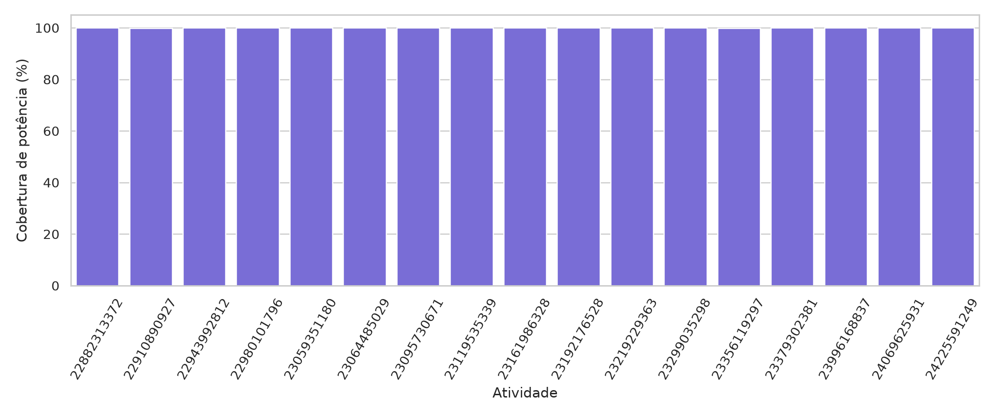
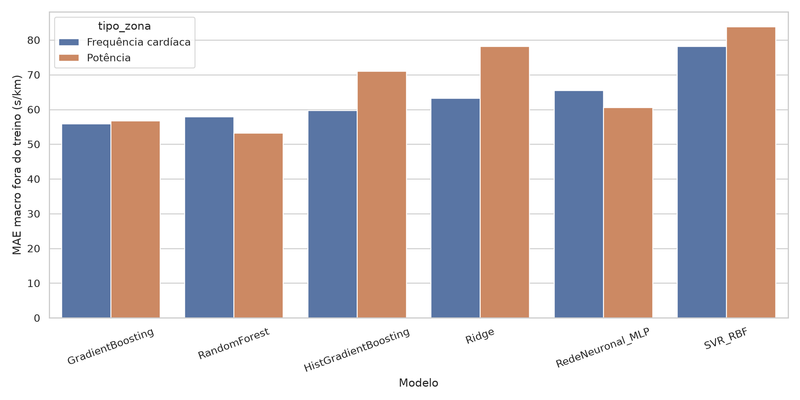

# Experiência — zonas cardíacas versus zonas de potência

## Objetivo e desenho

Esta experiência testa se a gama de potência melhora a previsão do ritmo face à gama de frequência cardíaca. A comparação usa os mesmos **2972 troços de 50 m**, as mesmas **17 atividades**, os mesmos alvos e os mesmos folds `LeaveOneGroupOut`. Em cada versão mudam apenas a zona e os seus limites.

As métricas desta experiência só devem ser comparadas entre si. Não são diretamente comparáveis com as métricas do modelo principal, porque o subconjunto contém apenas atividades com potência e usa um único alvo pareado por troço.

A potência exata e a FC exata servem apenas para classificar os dados históricos e não entram como features do modelo. O alvo continua a ser calculado por distância e tempo. Esta construção evita que uma alternativa ganhe por usar mais observações.

Dos 34 FIT analisados, **17 têm potência**. Nestas atividades, a cobertura dos registos de potência é aproximadamente total.

Foram usados os limites de potência do FIT mais recente: **220, 270, 304, 339, 390, 4000 W**, com limiar funcional de **339 W**.

## Associação com o ritmo

| tipo_zona           |   pearson_valor_ritmo |   spearman_valor_ritmo |   spearman_zona_ritmo |   n_trocos |   n_atividades |
|:--------------------|----------------------:|-----------------------:|----------------------:|-----------:|---------------:|
| Frequência cardíaca |                -0.216 |                 -0.42  |                -0.431 |       2972 |             17 |
| Potência            |                -0.528 |                 -0.569 |                -0.108 |       2972 |             17 |

A potência média contínua apresenta uma relação mais forte com o ritmo do que a FC média. Porém, ao reduzir a potência às cinco gamas Garmin, grande parte dessa informação desaparece: a correlação ordinal da zona de potência é substancialmente mais fraca do que a da zona cardíaca.

Ao controlar aproximadamente o terreno por classes de declive, a potência contínua mantém correlações fortes com o ritmo:

| classe_declive   |   FC média |   Potência média |   Zona FC |   Zona potência |
|:-----------------|-----------:|-----------------:|----------:|----------------:|
| descida          |     -0.641 |           -0.897 |    -0.632 |          -0.078 |
| descida forte    |     -0.473 |           -0.613 |    -0.47  |           0.457 |
| plano            |     -0.623 |           -0.909 |    -0.615 |          -0.356 |
| subida           |     -0.725 |           -0.895 |    -0.709 |          -0.593 |
| subida forte     |     -0.125 |           -0.793 |    -0.184 |          -0.355 |

## Cobertura das zonas

|   Zona |   Troços — FC |   Troços — potência |
|-------:|--------------:|--------------------:|
|      1 |            29 |                1180 |
|      2 |           675 |                 448 |
|      3 |           965 |                 232 |
|      4 |          1066 |                 371 |
|      5 |           237 |                 741 |

## Validação dos modelos

| tipo_zona           | modelo               |   mae_macro_s_km |   rmse_macro_s_km |   r2_macro |   melhoria_vs_dummy_pct |
|:--------------------|:---------------------|-----------------:|------------------:|-----------:|------------------------:|
| Frequência cardíaca | GradientBoosting     |            55.93 |             73.17 |      -1.18 |                   36.13 |
| Frequência cardíaca | RandomForest         |            57.96 |             75.57 |      -1.43 |                   33.82 |
| Frequência cardíaca | HistGradientBoosting |            59.69 |             77.83 |      -1.4  |                   31.84 |
| Frequência cardíaca | Ridge                |            63.2  |             80.89 |      -4.38 |                   27.82 |
| Frequência cardíaca | RedeNeuronal_MLP     |            65.48 |             83.1  |      -1.86 |                   25.23 |
| Frequência cardíaca | SVR_RBF              |            78.15 |             98.43 |      -9.1  |                   10.76 |
| Frequência cardíaca | Dummy                |            87.57 |            106.1  |     -16.03 |                    0    |
| Potência            | RandomForest         |            53.26 |             73.06 |      -2.21 |                   39.18 |
| Potência            | GradientBoosting     |            56.71 |             73.6  |      -2.2  |                   35.24 |
| Potência            | RedeNeuronal_MLP     |            60.59 |             80.66 |      -2.49 |                   30.81 |
| Potência            | HistGradientBoosting |            71.06 |             88.85 |      -2.58 |                   18.85 |
| Potência            | Ridge                |            78.17 |             94.03 |     -10.45 |                   10.73 |
| Potência            | SVR_RBF              |            83.86 |            103.13 |     -11.13 |                    4.23 |
| Potência            | Dummy                |            87.57 |            106.1  |     -16.03 |                    0    |

O melhor resultado cardíaco foi **GradientBoosting**, com MAE macro de **55.93 s/km**. O melhor resultado por potência foi **RandomForest**, com **53.26 s/km**.

A potência reduz o MAE em média **2.67 s/km**, mas vence apenas **8 de 17 atividades**. O intervalo bootstrap de 95% da diferença potência menos FC é **[-8.94, 3.49] s/km** e atravessa zero. O RMSE dos dois vencedores é praticamente igual.

## Conclusão

Os dados sustentam que a **potência contínua contém mais informação instantânea sobre o ritmo**, mas ainda não demonstram que **cinco gamas de potência** generalizem melhor do que as zonas cardíacas. A pequena melhoria média é incerta e depende do algoritmo.

O modelo atual não deve ser substituído com base nesta execução. O teste deve ser repetido quando existirem mais atividades com potência. Também faz sentido avaliar as zonas históricas relativas ao limiar funcional registado em cada atividade, porque o FTP observado nos FIT variou ao longo do tempo.

## Ficheiros auditáveis

- `trocos_pareados.csv`: amostras idênticas usadas nas duas alternativas;
- `correlacoes.csv`: correlações contínuas e por zona;
- `correlacoes_por_declive.csv`: associações dentro de classes de terreno;
- `metricas_por_atividade.csv`: métricas de cada fold;
- `previsoes_fora_do_treino.csv`: previsões estritamente fora do treino;
- `resumo_modelos.csv`: ranking agregado;
- `resultado.json`: síntese estruturada.
